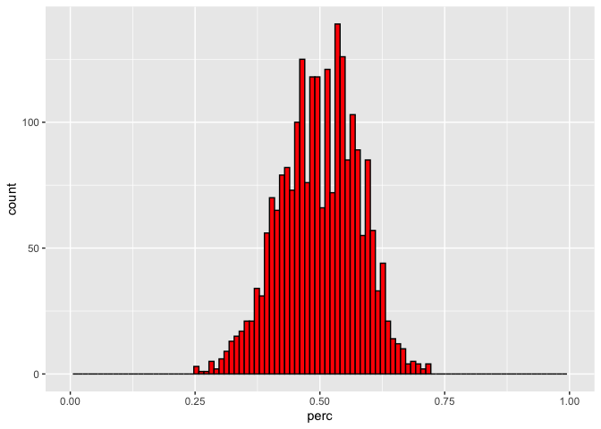

MLB Winning Percentages - A General Inquiry
================
brian higginbotham
2025-04-10

What is the difference between being the best and worst team in Major
League Baseball? This quick dive into the last 100 seasons of current
MLB franchises will look at almost 3,000 winning percentages and map
their distribution. From the resulting histogram and quantile
calculations, we’ll get a good sense of the range between a first-place
and last-place season.

**Packages**

``` r
# packages used
library(readr)
library(tidyverse)
```

## 0.1 Retrieving the Data

The team records for each season are from [Baseball
Reference](https://www.baseball-reference.com/teams/). Each teams
complete season records were exported as `.csv` file. (Technically, the
files are `.txt`, but uses the coma as the separating value, so it
behaves like a `.csv`)

We’ll need to combine each team’s records into one dataframe. Before we
do that, let’s set up some simple data read and processing commands to
ensure we’re extracting the information we want from the team files

``` r
# each team's file is labeled with the team abbreviation. So here, we're reading the Chicago Cubs.
w_perc <- read_csv("../../db/mlb/chc.txt")
# renaming the columns that will be kept in the dataframe
w_perc <- rename(w_perc, year = Year, perc = 'W-L%', team=Tm)
# selecting only the renamed columns for the dataframe
w_perc <- select(w_perc, year, team, perc)
# filtering the dataframe to the last 100 years
w_perc <- filter(w_perc, year >= 1925, year < 2025)

head(w_perc)
```

    ## # A tibble: 6 × 3
    ##    year team          perc
    ##   <dbl> <chr>        <dbl>
    ## 1  2024 Chicago Cubs 0.512
    ## 2  2023 Chicago Cubs 0.512
    ## 3  2022 Chicago Cubs 0.457
    ## 4  2021 Chicago Cubs 0.438
    ## 5  2020 Chicago Cubs 0.567
    ## 6  2019 Chicago Cubs 0.519

## 0.2 Data Reading & Processing Function

Now that we have the commands to read and process the data into the
desired format, we simplify all these separate commands into one
function:

``` r
# the argument for read_csv() must be a string format (" "), so we have to enter the function argument, team, as a string
perc_win <- function(team = "str"){
  txtfile <- paste0("../../db/mlb/", team,".txt")
  sheet <- read_csv(txtfile)
  sheet <- sheet %>%
    rename(year = Year, perc = 'W-L%', team=Tm) %>%
    select(year, team, perc) %>%
    filter(year >= 1925, year < 2025)
  return(sheet)
}
```

Now let’s test our function

``` r
perc_win("chw")
```

    ## # A tibble: 100 × 3
    ##     year team               perc
    ##    <dbl> <chr>             <dbl>
    ##  1  2024 Chicago White Sox 0.253
    ##  2  2023 Chicago White Sox 0.377
    ##  3  2022 Chicago White Sox 0.5  
    ##  4  2021 Chicago White Sox 0.574
    ##  5  2020 Chicago White Sox 0.583
    ##  6  2019 Chicago White Sox 0.447
    ##  7  2018 Chicago White Sox 0.383
    ##  8  2017 Chicago White Sox 0.414
    ##  9  2016 Chicago White Sox 0.481
    ## 10  2015 Chicago White Sox 0.469
    ## # ℹ 90 more rows

Ooof, 2024 was not a good year for the White Sox. But on the brighter
side, it does look like our function works correctly - producing 100
season winning percentages for the Chi Town White Sox.

But just how bad were the White Sox compared to all teams over the last
100 seasons?

To find out, we’ll need to build a single dataframe from all of the
teams datasets and look at the distribution of the winning percentages.

## 0.3 Combining Data Sets

To combine the data sets into a single dataframe, we’ll write a simple
`for loop` to iterate over the file names utilizing our `perc_win()`
function and then use `bind_rows()` to append each data set to the
single data frame.

First, we’ll need a list of teams/filenames to iterate over.

``` r
teams <- list("ana", "ari", "atl", "bal", "bos", "chc", "chw", "cin", "cle", "col", "det", "hou", "kcr", "lad", "mia", "mil", "min", "nym", "nyy", "oak", "phi", "pit", "sdp", "sea", "sfg", "stl", "tbd", "tex", "tor", "wsn")
```

Next, we’ll initiate an empty dataframe that the resulting datasets from
the `for loop` can be added to. Then we initiate the `for loop` using
the `perc_win()` and `bind_rows()` functions.

``` r
win_perc <- data.frame()

for(i in teams){
  data = perc_win(i)
  win_perc <- bind_rows(win_perc, data)
}

str(win_perc)
```

    ## 'data.frame':    2292 obs. of  3 variables:
    ##  $ year: num  2024 2023 2022 2021 2020 ...
    ##  $ team: chr  "Los Angeles Angels" "Los Angeles Angels" "Los Angeles Angels" "Los Angeles Angels" ...
    ##  $ perc: num  0.389 0.451 0.451 0.475 0.433 0.444 0.494 0.494 0.457 0.525 ...

Great! The resulting dataframe has over 2200 entries. It looks like we
have our winning percentages for each team over the past 100 seasons.
(If you’re thinking “shouldn’t there be 3000 entries since there are 30
teams and 100 seasons?”, you should remember that some current
franchises did not exist in 1925 and so we get less than 100 entries for
those franchises)

## 0.4 Histogram & Other Explorations

Now let’s take a look a histogram of the winning percentages

``` r
g <- ggplot(win_perc, aes(x=perc))
g + geom_histogram(bins=100, color="black", fill="red") + xlim(0, 1)
```

<!-- -->

Over the last 100 MLB seasons, the range of winning percentages is from
about 0.25 to about 0.700. Wow, so it looks like the Chicago White Sox
had one of, if not the worst winning record of the last 100 years. Let’s
confirm who the owner of the worst record really is.

``` r
filter(win_perc, perc == min(win_perc$perc))
```

    ##   year          team  perc
    ## 1 1935 Boston Braves 0.248

Not quite dead last CHW, but probably a little too close for comfort!

On a lighter note, let’s see who owns the largest winning percentage of
the past 100 years

``` r
filter(win_perc, perc == max(win_perc$perc))
```

    ##   year              team  perc
    ## 1 1954 Cleveland Indians 0.721

Impressive! Too bad they lost 4-0 in that year’s World Series.

Let’s leave off the outliers and see where 95% of the winning
percentages lie

``` r
quantile(win_perc$perc, probs = c(0.025, 0.975))
```

    ##    2.5%   97.5% 
    ## 0.34055 0.64000

Interesting, it seems that the vast majority (95%) of winning
percentages lie between about 33% and 66%. I rounded to these numbers to
get a different perspective on this difference - it would appear that
last place teams win about 1 out of 3 games while first place teams win
about 2 out of 3. Given that the majority of season series are 3 games,
this result totally makes sense!
